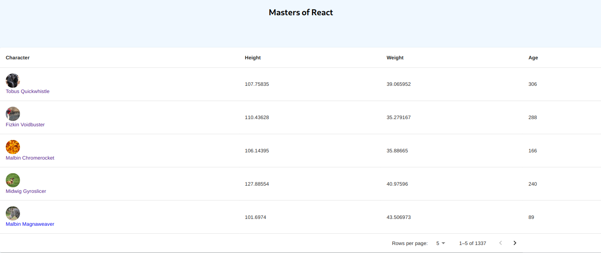

# Introduction

Simple data table showcasing master-detail view pattern in [React](https://reactjs.org/) using the [Material Design](https://mui.com/) UI component Library and a [Context Provider](https://reactjs.org/docs/context.html) pattern for data reusability in a global scope. Bare minimal project architecture was added as a means to achieving modularity.

# Installation:

First, clone this repo:

```bash
git clone https://github.com/luisrowley/react-list-detail
```

Navigate to the project's folder:

```bash
cd react-list-detail
```

And install dependencies with:

```bash
npm i
```

## Available Scripts

In the project directory, you can run:

### `npm start`

Runs the app in the development mode.\
Open [http://localhost:3000](http://localhost:3000) to view it in the browser.

The page will reload if you make edits.\
You will also see any lint errors in the console.

By now you should be seeing a [table](https://mui.com/material-ui/react-table/) with pagination on the main page:



### `npm test`

Launches the test runner in the interactive watch mode.\
See the section about [running tests](https://facebook.github.io/create-react-app/docs/running-tests) for more information.

### `npm run build`

Builds the app for production to the `build` folder.\
It correctly bundles React in production mode and optimizes the build for the best performance.

The build is minified and the filenames include the hashes.\
Your app is ready to be deployed!

See the section about [deployment](https://facebook.github.io/create-react-app/docs/deployment) for more information.

## Author(s)

Luis De Benito